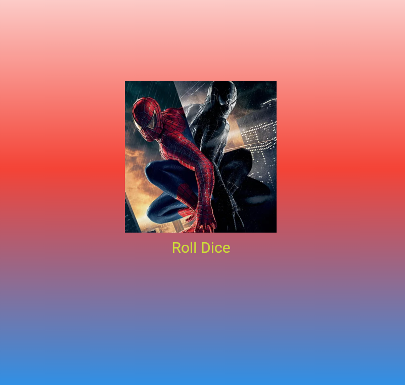

# Лабораторная работа №3. Flutter: структура UI и компонентный подход
## Кузьмина Диана ИСП-232
___
### **Цель работы**: Научиться строить UI через дерево виджетов, создавать собственные виджеты-классы, разбивать код на файлы и передавать данные через параметры

___
**BuildContext** — это объект, который содержит информацию о положении виджета в дереве. Flutter передаёт его автоматически при каждой перерисовке. Пока он нам не нужен напрямую, но метод без него работать не будет.
@**override** вы уже знаете из Kotlin и C# — он сигнализирует что мы переопределяем метод родительского класса. Аннотация @override не обязательна для компиляции, но является хорошей практикой, потому что позволяет компилятору проверить, что мы действительно переопределяем метод родительского класса.